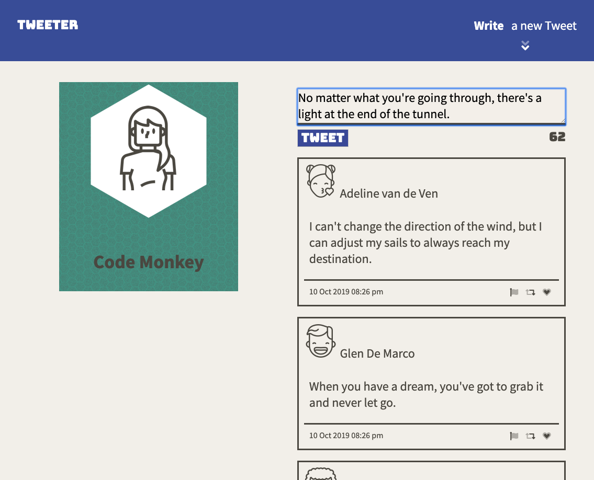
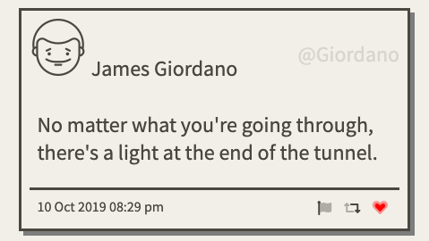
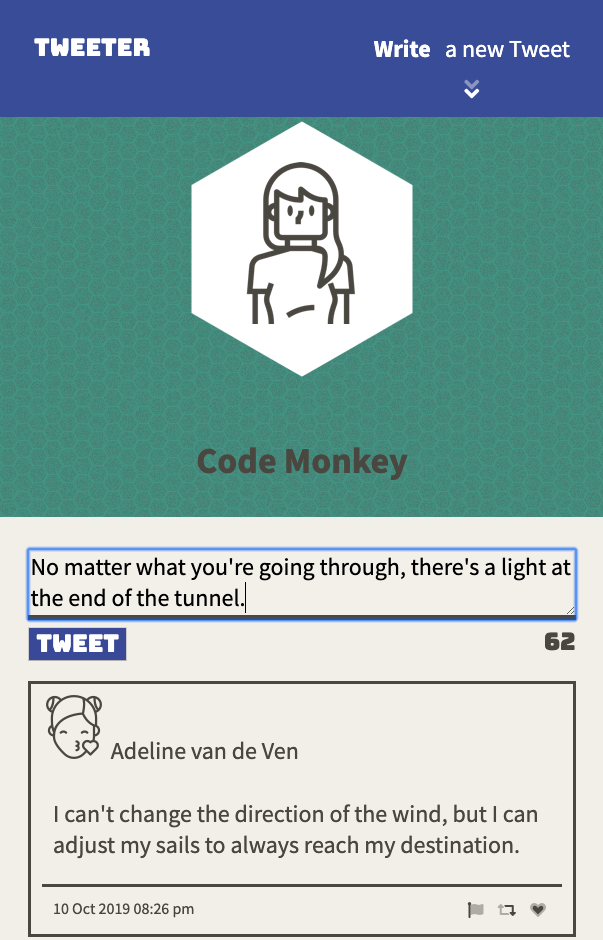
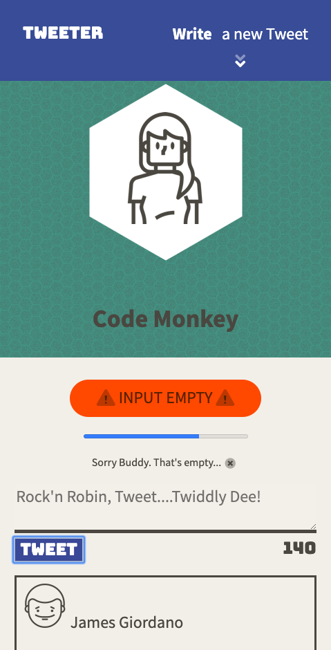

# Tweeter Project

Tweeter is a simple, single-page Twitter clone.

It was built in 4 days and is part of the 12 week Lighthouse Labs bootcamp.

Built with HTML, CSS, JS, jQuery and AJAX, Node & Express.

## Try it out!

1. Fork & clone this repository.
2. Install dependencies using the `npm install` command.
3. Start the web server using the `npm run local` command. The app will be served at <http://localhost:8080/>.
4. Go to <http://localhost:8080/> in your browser.

## Dependencies

- Express
- Node 5.10.x or above
- "body-parser": "^1.15.2",
- "chance": "^1.0.2",
- "md5": "^2.1.0"

## Screen Shots
### Large Screen View

### Animated Icons

### Small Screen View

### Error Message
